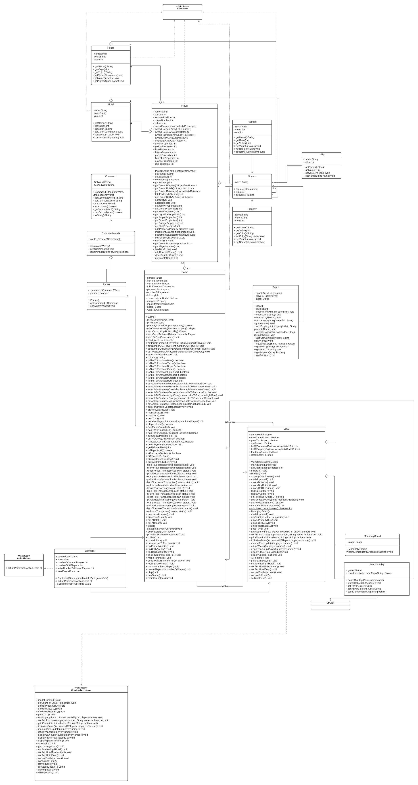

# Monopoly

## Contributors
John Afolayan, Ibrahim Said, Hamza Zafar

### Description
The project is a simplified version of the classic board game Monopoly. It is simplified by eliminating the Chance/Community chest cards and by not allowing mortgages nor sales and trades between players. The cost of rent, houses and hotels are simplified by using fixed percentages of the initial cost of the property.

### Rules
The game rules can be found [here.](https://www.officialgamerules.org/monopoly)

### Features
•	Boards are initialized using an XML file, therefore anyone can add a custom version of their preference via XML

•	This game features artificially intelligent player(s). The AI player makes decisions based on predetermined outcomes

•	An instance of a game can be saved, it is saved to a text file called *gamefile.txt* (click *Load Game* upon a new game instance to reload the saved instance)

### Versions
There are five versions of Monopoly:

•	Original

•	Restaurant

•	The Simpsons

•	Futurama

•	CityVille

### Design Decision & Major Class Functionality

**Game**

• It has getters and setters for Player class and board class

• Holds an ArrayList of Players.

• is Serializable.

• After a user selects the board they want to play on, Game automatically sets the corresponding background file name to use (since our XML and PNG files have the same name but different file types). Controller then gets the background file name, passes it to view which places it on the frame.

• After a user selects the board they want to play on, Game also stores the XML file name and picture file name into variables. These variables are used as getters when a user decides to save a state of a game. Since an image isn’t serializable, the load feature gets the string of which XML version was used as well as which PNG image was used from Game class. This is, of course, handled by Controller.

• When a game is saved, Game creates a file called gamefile.txt which contains all data of a saved Game’s instance. If another save is made, the gamesave.txt file is overwritten.

**View**

• The visual driver of the Model package.

• The view contains multiple JOptionPane which request user input for the number of human & AI players.
  ◦ The number of AI players will be the difference of 8 and the number of human players.
  ◦ The number of human players is a minimum of 2, to a maximum of 8.
  ◦ The number of AI players is a minimum of 0, its maximum depends on the user specified number of human players.
  ◦ If a user selects 8 humans, there will be no room for AI, so the only option will be 0.

• The view contains a JOptionPane which requests if a user wants to leave Jail or not (if they are in jail).

• The view contains a JOptionPane which requests if a player wants to buy/sell a house and determines if the player is eligible, and then returns a message showing the result.

• Implements methods from ModelUpdateListener interface.

• It shows the Monopoly board and buttons a user can interact with, which invokes ActionListener.

• It creates an instance of BoardOverlay() which shows a player’s position on the board.

• Handles the update method which is invoked by the Model and updates itself to shows the changes.

• Has a text area which shows the game status as it progresses.

• A user chooses which board type they would like to play on
  ◦ The view displays the picture corresponding to the XML version which was chosen unto the frame.

• Has new buttons: ‘Save Current Game’ and ‘Load Game’.

**Controller**

• Handles action performed for new buttons: ‘Save Current Game’ and ‘Load Game’, as well as previous buttons.

• When a New Game is started, Controller gets the XML and background file names from Game class and passes them on to View. Controller also passes the XML file type back to Game class which then calls board to initialize itself.

**Player**

• Part of the model.

• Represents the Players in our Monopoly game.

• The player knows the properties they currently own (stored in an ArrayList).

• The player knows the amount of money they have at hand.

• Has methods to check if a player rolled a double.

**Board**

• Reads in the string of the XML file name. Uses string to locate the file and then parse it. Parse the file and adds the respective data (property, railroad, utility) to the board class ArrayList.

### User Manual
• Run the JarFile or clone the project locally and run the main method in View class

• Press New Game at the bottom left of the GUI

• Select which version of Monopoly you’d like to play on

• Select the number of human players which will be playing, from the drop down menu

• Select the available number of AI players you would like from the drop down menu (only if number of human players is less 8)

• Click Roll Die to get the first player to make a move.

• If a double is rolled, the player will be prompted to roll again (if they are human) or they will automatically roll again (if they are AI).

• If a die is rolled and you land on an available property/railroad/utility, you will be prompted to purchase the property. Click ‘Buy’ to proceed or ‘Pass Turn’ to avoid purchasing.

• If a die is rolled and you land on a taxable square (e.g., Income Tax) a certain amount will be deducted from your balance, in this case $200.

▪ When it is an AI’s turn, you may be required to click the ‘Roll Die’ button. This will result in all AIs making a move and the turn will be brought back to the next available human player.

▪ If you land on ‘Go To Jail’ you will automatically be redirected to Jail. In this case, you will be prompted to pay to leave. If yes, you will be redirected to ‘Just Visiting’, otherwise, you will remain in Jail.

• When you pass Go, a balance of $200 will be added to your account.

• When you land on another player or AI’s property/utility/railroad, you will be taxed a certain amount which will be deducted from your balance.

• If you decide that you would like to save the current instance of the game you are playing, click the ‘Save Current Game’ button at the bottom and feel free to quit the game.

    ◦ When you decide to continue your previous instance, click the ‘Load Game’ button and continue right where you left off.

• As the game progresses, it is likely that some players will go bankrupt and will be removed from the game. Once the players are down to one, the game will be finished and the player will be prompted that they have won.

• Your options are New Game, Load Game, Roll Die, Pass Turn, State, Buy/Sell Hotel, Buy/Sell House, Save Current Game, Quit Game 

◦ New Game: Choose the board you would like to play on and the amount of human/AI you would like to play with.

◦ Load Game: Click the ‘Load Game’ button and if a gamefile.txt file exits, the previous game instance will be loaded, unless an exception occurs.

◦ Roll Die: Move the current player to an index specified by the amount they rolled + the previous position:

      ▪ Press the Roll Die button

      ▪ Observe the player color changing to a new index on the GUI frame. Choose your next action depending on which square you land on (see above).

      ▪ If a human rolls a die and lands on a spot which no action is required (no prompt to buy a house, pay to leave jail, etc.), the game automatically passes turn to the AIs, and they make their moves in succession.

◦ Pass Turn: Passes the turn from you to the next player (used to opt out of purchasing)

      ▪ Click the Pass Turn button at the bottom right.

      ▪ If the next player is an AI, they will automatically make their moves.

◦ Buy/Sell Hotel: Checks if player is eligible to purchase hotel. If so, hotel is purchased. Otherwise, hotel is not purchased.

      ▪ Click the Buy/Sell Hotel button at the bottom center

      ▪ Enter buy if you wish to buy or sell if you wish to sell a hotel.

      ▪ The game checks if you are eligible for the command you entered and processes the desired outcome depending on eligibility.

      ▪ In the case that a player is not eligible, the game will prompt them ‘Sorry, you cannot buy a hotel.’

◦ Buy/Sell House: Checks if player is eligible to purchase house. If so, house is purchased. Otherwise, house is not purchased.

      ▪ Click the Buy/Sell House button at the bottom center

      ▪ Enter buy if you wish to buy or sell if you wish to sell a house.

      ▪ The game checks if you are eligible for the command you entered and processes the desired outcome depending on eligibility.

      ▪ In the case that a player is not eligible, the game will prompt them ‘Sorry, you cannot buy a house.’

◦ Save Current Game: Save the current game instance and prints a message saying "The game has been saved!" if successful, otherwise it prints, "There was an error saving the game."

◦ Quit: Exit the game.

      ▪ Press the Quit Game button at the bottom

### User Manual
Clone the project from GitHub: https://github.com/John-Afolayan/Monopoly and run the GameTest.java class.

### Documentation
**UML**

**Creating a New Game with a Custom Board**

**Saving a Game**

### Known Issues
•	In the case which a player lands on a taxable square after passing Go, they are not taxed.

•	Cancelling out of popup dialogues e.g. buy/sell house/hotel, throws unhandled NullPointerExceptions

### This game was created for educational purposes and no copyright infringement was intended.
